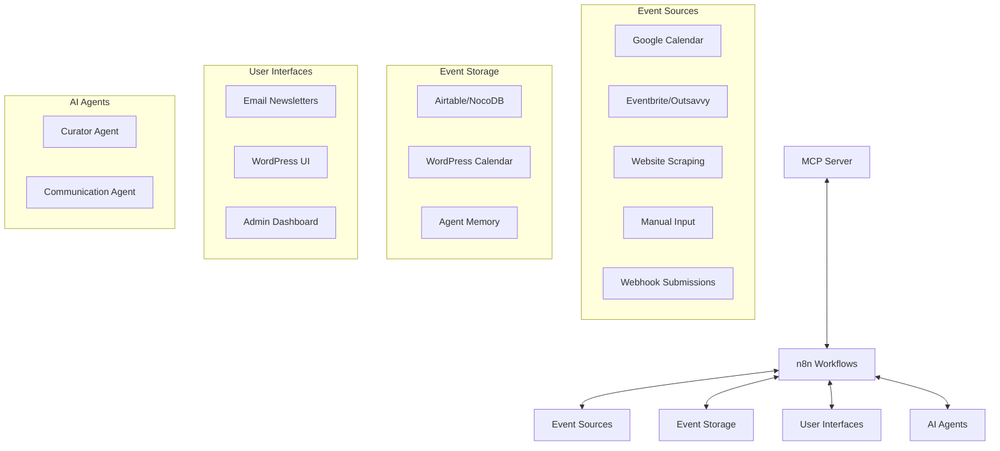
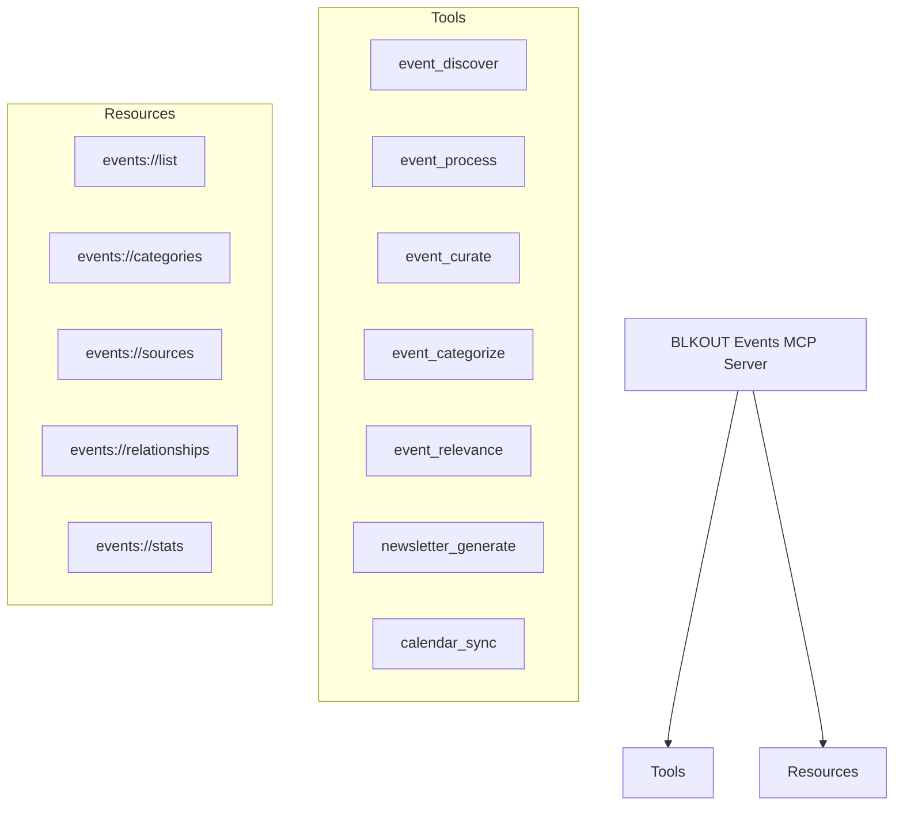
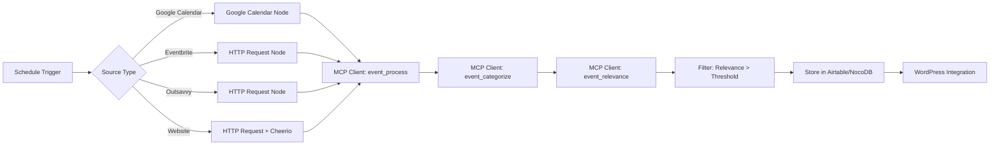
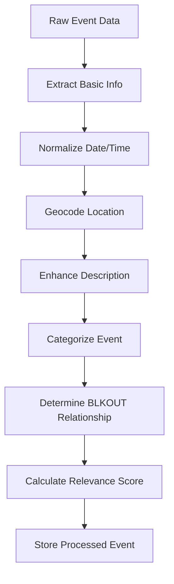
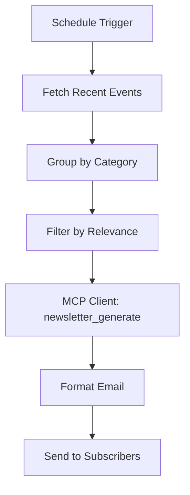

# BLKOUT Events Calendar Integration System Plan

This document outlines a comprehensive plan for implementing an integrated events calendar system for BLKOUT UK using n8n workflows and MCP server integration. The system will automate the discovery, processing, and curation of events relevant to the Black LGBTQ+ community, leveraging AI agents with MCP client tools, LLM capabilities, and memory.

## 1. System Architecture Overview



## 2. MCP Server Implementation

### 2.1 BLKOUT Events MCP Server

We'll create a dedicated MCP server that provides tools and resources for AI assistants to interact with the events calendar system:



### 2.2 MCP Server Tool Definitions

The MCP server will provide the following tools:

1. `event_discover`: Discover events from specified sources
   - Parameters: `source_type`, `search_terms`, `date_range`, `location`
   - Returns: List of discovered event URLs or raw event data

2. `event_process`: Extract structured information from event sources
   - Parameters: `event_url` or `event_data`, `source_type`
   - Returns: Structured event information according to the defined schema

3. `event_curate`: Curate and enhance event information
   - Parameters: `event_data`
   - Returns: Enhanced event data with improved descriptions and metadata

4. `event_categorize`: Categorize events based on content and audience
   - Parameters: `event_data`
   - Returns: Event data with appropriate categories and tags

5. `event_relevance`: Assess relevance and priority for the BLKOUT audience
   - Parameters: `event_data`
   - Returns: Event data with relevance score and priority level

6. `newsletter_generate`: Generate targeted event newsletters
   - Parameters: `event_category`, `date_range`, `audience_type`
   - Returns: Formatted newsletter content

7. `calendar_sync`: Synchronize events with external calendars
   - Parameters: `direction` (import/export), `calendar_id`, `date_range`
   - Returns: Sync status and results

## 3. n8n Workflow Implementation

### 3.1 Event Discovery Workflow



### 3.2 Event Processing Pipeline

For each discovered event, the system will process it through the following pipeline:



### 3.3 Newsletter Generation Workflow



## 4. Implementation Details

### 4.1 Event Discovery and Extraction

#### 4.1.1 Google Calendar Integration

```javascript
// n8n Google Calendar Node Configuration
{
  "resource": "event",
  "operation": "getAll",
  "calendar": "{{ $node.MCP_Config.json.calendarId }}",
  "timeMin": "{{ $now.minus(1, 'days').format() }}",
  "timeMax": "{{ $now.plus(60, 'days').format() }}",
  "singleEvents": true,
  "orderBy": "startTime"
}
```

#### 4.1.2 Eventbrite Scraping

```javascript
// n8n HTTP Request + Function Node
const $ = cheerio.load($input.data);
const events = [];

// Extract events from Eventbrite search results
$('.event-card').each((i, el) => {
  const title = $(el).find('.event-card__title').text().trim();
  const dateStr = $(el).find('.event-card__date').text().trim();
  const location = $(el).find('.event-card__venue').text().trim();
  const link = $(el).find('a.event-card__link').attr('href');
  const imageUrl = $(el).find('.event-card__image').attr('src');
  
  // Check if event matches BLKOUT criteria
  const description = $(el).find('.event-card__description').text().trim();
  const isRelevant = /black|lgbtq|queer|trans|gay|lesbian|bisexual/i.test(description + title);
  
  if (isRelevant) {
    events.push({
      title,
      dateStr,
      location,
      link,
      imageUrl,
      source: 'Eventbrite'
    });
  }
});

return { events };
```

#### 4.1.3 Website Scraping with Adaptive Approach

```javascript
// n8n Function Node for adaptive scraping
const adaptiveScrape = (html, config) => {
  const $ = cheerio.load(html);
  const events = [];
  
  // Try different selectors based on site structure
  const eventSelectors = config.eventSelectors || ['.event', '.event-card', '[itemtype="http://schema.org/Event"]'];
  
  for (const selector of eventSelectors) {
    const elements = $(selector);
    if (elements.length > 0) {
      elements.each((i, el) => {
        // Extract event data using site-specific selectors
        // ...
        events.push(extractedEvent);
      });
      break; // Found working selector
    }
  }
  
  return events;
};

// Site-specific configurations
const siteConfigs = {
  'ukblackpride.org.uk': {
    eventSelectors: ['.event-listing', '.tribe-events-list-event'],
    titleSelector: '.event-title, .tribe-event-title',
    // ...
  },
  'stonewalluk.org': {
    eventSelectors: ['.event-card', '.event-listing'],
    titleSelector: '.event-title, h3.title',
    // ...
  },
  // Add more sites as needed
};

// Determine which config to use based on URL
const domain = new URL($input.url).hostname;
const config = siteConfigs[domain] || {};

return { events: adaptiveScrape($input.data, config) };
```

### 4.2 Event Processing and Categorization

#### 4.2.1 Event Categorization Function

```javascript
// n8n Function Node for categorization
function categorizeEvent(event) {
  const text = `${event.title} ${event.description}`.toLowerCase();
  const categories = [];
  
  // Category detection based on keywords
  const categoryKeywords = {
    community: ['community', 'meetup', 'networking', 'social group'],
    social: ['party', 'club', 'social', 'mixer', 'drinks'],
    workshop: ['workshop', 'skill', 'training', 'interactive', 'learn'],
    art: ['performance', 'exhibition', 'film', 'screening', 'creative', 'art'],
    health: ['wellness', 'mental health', 'physical health', 'wellbeing'],
    education: ['talk', 'panel', 'discussion', 'lecture', 'seminar'],
    support: ['support group', 'peer support', 'counseling', 'therapy'],
    activism: ['protest', 'campaign', 'political', 'rights', 'justice'],
    pride: ['pride', 'celebration']
  };
  
  // Check each category
  for (const [category, keywords] of Object.entries(categoryKeywords)) {
    if (keywords.some(keyword => text.includes(keyword))) {
      categories.push(category);
    }
  }
  
  // Determine BLKOUT relationship
  let relationship = 'other';
  if (text.includes('blkout') || text.includes('blkout uk')) {
    relationship = 'partner';
  } else if (/qtipoc|queer.+poc|trans.+poc|black.+queer|black.+lgbtq/i.test(text)) {
    relationship = 'QTIPOC ally';
  }
  
  // Calculate relevance score (0-100)
  let relevanceScore = 0;
  
  // Base score for all LGBTQ+ events
  if (/lgbtq|queer|gay|lesbian|bisexual|trans/i.test(text)) {
    relevanceScore += 30;
  }
  
  // Additional points for Black focus
  if (/black|afro|african/i.test(text)) {
    relevanceScore += 30;
  }
  
  // Additional points for QTIPOC focus
  if (/qtipoc|qpoc|bpoc|poc.+queer|queer.+poc/i.test(text)) {
    relevanceScore += 20;
  }
  
  // Additional points for community-building events
  if (categories.includes('community') || categories.includes('support')) {
    relevanceScore += 10;
  }
  
  // Cap at 100
  relevanceScore = Math.min(relevanceScore, 100);
  
  return {
    ...event,
    categories,
    relationship,
    relevanceScore
  };
}

return categorizeEvent($input.event);
```

#### 4.2.2 Event Description Enhancement

```javascript
// n8n Function Node for description enhancement
function enhanceDescription(event) {
  // Create short description if missing
  if (!event.shortDescription && event.description) {
    // Extract first sentence or create summary
    const firstSentence = event.description.split(/\.\s+/)[0] + '.';
    event.shortDescription = firstSentence.length < 150 ? 
      firstSentence : 
      event.description.substring(0, 147) + '...';
  }
  
  // Ensure description has key information
  let enhancedDesc = event.description || '';
  
  // Add missing information if available
  if (event.cost && !enhancedDesc.includes('cost') && !enhancedDesc.includes('price')) {
    enhancedDesc += `\n\nCost: ${event.cost}`;
  }
  
  if (event.locationName && !enhancedDesc.toLowerCase().includes(event.locationName.toLowerCase())) {
    enhancedDesc += `\n\nLocation: ${event.locationName}, ${event.locationCity || ''}`;
  }
  
  return {
    ...event,
    description: enhancedDesc,
    shortDescription: event.shortDescription
  };
}

return enhanceDescription($input.event);
```

### 4.3 Date/Time Handling and Timezone Management

```javascript
// n8n Function Node for date/time normalization
function normalizeDateTime(event) {
  // Parse date strings into standardized format
  let startDateTime, endDateTime;
  
  try {
    // Handle various date formats
    if (event.startDate && event.startTime) {
      startDateTime = moment(`${event.startDate} ${event.startTime}`);
    } else if (event.dateStr) {
      // Parse from combined date string
      // This will need custom parsing logic based on source format
    } else if (event.start) {
      // Direct ISO format or timestamp
      startDateTime = moment(event.start);
    }
    
    // Similar logic for end date/time
    // ...
    
    // Ensure timezone is properly set
    const timezone = event.timezone || 'Europe/London';
    
    // Convert to ISO format with timezone
    const startISO = startDateTime ? startDateTime.tz(timezone).format() : null;
    const endISO = endDateTime ? endDateTime.tz(timezone).format() : null;
    
    return {
      ...event,
      startDateTime: startISO,
      endDateTime: endISO,
      timezone
    };
  } catch (error) {
    // Handle parsing errors
    return {
      ...event,
      dateTimeError: error.message
    };
  }
}

return normalizeDateTime($input.event);
```

### 4.4 Error Handling and Monitoring

```javascript
// n8n Error Trigger Node Configuration
{
  "events": [
    {
      "name": "Error in Event Discovery",
      "rules": [
        {
          "conditions": [
            {
              "id": "1",
              "key": "workflow.name",
              "value": "Event Discovery"
            }
          ]
        }
      ]
    },
    {
      "name": "Error in Event Processing",
      "rules": [
        {
          "conditions": [
            {
              "id": "1",
              "key": "workflow.name",
              "value": "Event Processing"
            }
          ]
        }
      ]
    }
  ]
}
```

```javascript
// n8n Function Node for error handling
function handleError(error, context) {
  // Log detailed error information
  console.error(`Error in ${context.workflow}: ${error.message}`);
  
  // Create error notification
  const notification = {
    title: `Error in ${context.workflow}`,
    message: error.message,
    details: JSON.stringify({
      workflow: context.workflow,
      node: context.node,
      timestamp: new Date().toISOString(),
      input: context.input,
      error: {
        message: error.message,
        stack: error.stack
      }
    }, null, 2),
    severity: error.critical ? 'critical' : 'warning'
  };
  
  // Return for notification dispatch
  return { notification };
}

// Example usage
try {
  // Process event
  return processEvent($input.event);
} catch (error) {
  return handleError(error, {
    workflow: 'Event Processing',
    node: 'Process Event',
    input: $input.event
  });
}
```

### 4.5 Webhook Integration

#### 4.5.1 Webhook Receiver for Event Submissions

```javascript
// n8n Webhook Node Configuration
{
  "authentication": "basicAuth",
  "httpMethod": "POST",
  "path": "event-submission",
  "responseMode": "onReceived",
  "responseData": "firstEntryJson"
}
```

```javascript
// n8n Function Node for webhook validation
function validateEventSubmission(submission) {
  // Required fields
  const requiredFields = ['title', 'startDateTime', 'organizer'];
  const missingFields = requiredFields.filter(field => !submission[field]);
  
  if (missingFields.length > 0) {
    throw new Error(`Missing required fields: ${missingFields.join(', ')}`);
  }
  
  // Validate date format
  try {
    const startDate = new Date(submission.startDateTime);
    if (isNaN(startDate.getTime())) {
      throw new Error('Invalid date format');
    }
  } catch (error) {
    throw new Error(`Invalid start date/time: ${error.message}`);
  }
  
  // Sanitize inputs
  const sanitized = {};
  for (const [key, value] of Object.entries(submission)) {
    if (typeof value === 'string') {
      sanitized[key] = value.trim();
    } else {
      sanitized[key] = value;
    }
  }
  
  return {
    ...sanitized,
    submissionSource: 'webhook',
    submissionTime: new Date().toISOString()
  };
}

return validateEventSubmission($input.body);
```

#### 4.5.2 Webhook Notifications for Calendar Updates

```javascript
// n8n Function Node for webhook notification
function prepareWebhookNotification(event, action) {
  return {
    event: {
      id: event.id,
      title: event.title,
      startDateTime: event.startDateTime,
      endDateTime: event.endDateTime,
      location: event.locationName,
      categories: event.categories,
      relationship: event.relationship,
      relevanceScore: event.relevanceScore
    },
    action, // 'created', 'updated', or 'deleted'
    timestamp: new Date().toISOString()
  };
}

// n8n HTTP Request Node for webhook delivery
{
  "url": "={{ $node.Webhook_Config.json.notificationUrl }}",
  "method": "POST",
  "authentication": "basicAuth",
  "username": "={{ $node.Webhook_Config.json.username }}",
  "password": "={{ $node.Webhook_Config.json.password }}",
  "body": "={{ $json }}",
  "headers": {
    "Content-Type": "application/json"
  }
}
```

## 5. MCP Server Implementation

### 5.1 MCP Server Structure

```
blkout-events-mcp-server/
├── src/
│   ├── index.ts                 # Main entry point
│   ├── config/                  # Configuration
│   ├── api/                     # API client for event sources
│   ├── tools/                   # MCP tools implementation
│   │   ├── event-discovery/     # Event discovery tools
│   │   ├── event-processing/    # Event processing tools
│   │   ├── newsletter/          # Newsletter generation tools
│   │   └── calendar/            # Calendar sync tools
│   ├── resources/               # MCP resources implementation
│   ├── types/                   # TypeScript type definitions
│   └── utils/                   # Utility functions
├── tests/                       # Test suite
├── package.json                 # Dependencies
└── tsconfig.json                # TypeScript configuration
```

### 5.2 Event Discovery Tool Implementation

```typescript
// src/tools/event-discovery/discover.ts
import { z } from 'zod';
import { ToolCallResult } from '../../types/index.js';
import { BaseToolHandler } from '../base-handler.js';
import { EventSourceClient } from '../../api/event-source-client.js';

/**
 * Event discovery input schema
 */
const eventDiscoverSchema = z.object({
  sourceType: z.enum(['google_calendar', 'eventbrite', 'outsavvy', 'website']),
  searchTerms: z.string().optional(),
  dateRange: z.object({
    start: z.string(),
    end: z.string()
  }),
  location: z.string().optional()
});

/**
 * Type for event discovery parameters
 */
type EventDiscoverParams = z.infer<typeof eventDiscoverSchema>;

/**
 * Handler for the event_discover tool
 */
export class EventDiscoverHandler extends BaseToolHandler {
  /**
   * Tool definition for event discovery
   */
  public static readonly inputSchema = eventDiscoverSchema;

  /**
   * Execute event discovery
   */
  async execute(args: Record<string, any>): Promise<ToolCallResult> {
    return this.handleExecution(async (args) => {
      // Parse and validate arguments
      const params = eventDiscoverSchema.parse(args);
      
      // Create appropriate client based on source type
      const client = new EventSourceClient(params.sourceType);
      
      // Discover events
      const events = await client.discoverEvents({
        searchTerms: params.searchTerms,
        dateRange: params.dateRange,
        location: params.location
      });
      
      // Return discovered events
      return this.formatSuccess({
        events,
        count: events.length,
        sourceType: params.sourceType
      }, `Discovered ${events.length} events from ${params.sourceType}`);
    }, args);
  }
}

/**
 * Get the tool definition for event_discover
 */
export function getEventDiscoverToolDefinition() {
  return {
    name: 'event_discover',
    description: 'Discover events from specified sources',
    inputSchema: {
      type: 'object',
      properties: {
        sourceType: {
          type: 'string',
          enum: ['google_calendar', 'eventbrite', 'outsavvy', 'website'],
          description: 'Type of event source'
        },
        searchTerms: {
          type: 'string',
          description: 'Search terms to filter events'
        },
        dateRange: {
          type: 'object',
          properties: {
            start: {
              type: 'string',
              description: 'Start date (ISO format)'
            },
            end: {
              type: 'string',
              description: 'End date (ISO format)'
            }
          },
          required: ['start', 'end']
        },
        location: {
          type: 'string',
          description: 'Location to filter events'
        }
      },
      required: ['sourceType', 'dateRange']
    }
  };
}
```

### 5.3 Event Processing Tool Implementation

```typescript
// src/tools/event-processing/process.ts
import { z } from 'zod';
import { ToolCallResult } from '../../types/index.js';
import { BaseToolHandler } from '../base-handler.js';
import { EventProcessor } from '../../utils/event-processor.js';

/**
 * Event processing input schema
 */
const eventProcessSchema = z.object({
  eventUrl: z.string().optional(),
  eventData: z.record(z.any()).optional(),
  sourceType: z.enum(['google_calendar', 'eventbrite', 'outsavvy', 'website', 'manual'])
}).refine(data => data.eventUrl || data.eventData, {
  message: 'Either eventUrl or eventData must be provided'
});

/**
 * Type for event processing parameters
 */
type EventProcessParams = z.infer<typeof eventProcessSchema>;

/**
 * Handler for the event_process tool
 */
export class EventProcessHandler extends BaseToolHandler {
  /**
   * Tool definition for event processing
   */
  public static readonly inputSchema = eventProcessSchema;

  /**
   * Execute event processing
   */
  async execute(args: Record<string, any>): Promise<ToolCallResult> {
    return this.handleExecution(async (args) => {
      // Parse and validate arguments
      const params = eventProcessSchema.parse(args);
      
      // Create event processor
      const processor = new EventProcessor(params.sourceType);
      
      // Process event
      const processedEvent = await processor.processEvent({
        url: params.eventUrl,
        data: params.eventData
      });
      
      // Return processed event
      return this.formatSuccess({
        event: processedEvent
      }, 'Event processed successfully');
    }, args);
  }
}

/**
 * Get the tool definition for event_process
 */
export function getEventProcessToolDefinition() {
  return {
    name: 'event_process',
    description: 'Extract structured information from event sources',
    inputSchema: {
      type: 'object',
      properties: {
        eventUrl: {
          type: 'string',
          description: 'URL of the event to process'
        },
        eventData: {
          type: 'object',
          description: 'Raw event data to process'
        },
        sourceType: {
          type: 'string',
          enum: ['google_calendar', 'eventbrite', 'outsavvy', 'website', 'manual'],
          description: 'Type of event source'
        }
      },
      required: ['sourceType']
    }
  };
}
```

## 6. Implementation Phases

### Phase 1: Core Infrastructure (Weeks 1-2)
1. Set up MCP server structure
2. Implement basic event discovery and processing tools
3. Create data schema and storage in Airtable/NocoDB
4. Set up basic n8n workflows for event discovery

### Phase 2: Source Integration (Weeks 3-4)
1. Implement Google Calendar integration
2. Add support for Eventbrite/Outsavvy
3. Create website scraping workflows for priority sources
4. Implement event categorization and relevance scoring

### Phase 3: Processing Pipeline (Weeks 5-6)
1. Enhance event description generation
2. Implement timezone handling and normalization
3. Add location geocoding and validation
4. Create comprehensive error handling

### Phase 4: WordPress Integration (Weeks 7-8)
1. Implement WordPress calendar integration
2. Create event display templates
3. Set up automated publishing workflow
4. Implement user notification system

### Phase 5: Newsletter and Advanced Features (Weeks 9-10)
1. Implement newsletter generation
2. Add targeted content based on user preferences
3. Create reporting and analytics dashboard
4. Implement system monitoring and alerts

## 7. Best Practices and Guidelines

### 7.1 Event Discovery Best Practices

- Schedule daily scraping of event listings sites
- Perform weekly deep research for events up to 60 days ahead
- Use specific search terms related to Black LGBTQ+ communities
- Implement adaptive scraping to handle website changes
- Maintain a list of priority sources and organizations

### 7.2 Event Processing Guidelines

- Extract complete and accurate information
- Normalize date/time formats with proper timezone handling
- Generate concise, engaging descriptions
- Categorize events appropriately
- Assess relevance and priority for the BLKOUT audience

### 7.3 Error Handling Strategy

- Implement comprehensive error logging
- Create notification system for critical errors
- Handle common failure scenarios (e.g., website structure changes)
- Implement automatic retry for transient errors
- Maintain manual override capabilities for edge cases

### 7.4 Performance Considerations

- Use incremental sync for large event sources
- Implement caching for frequently accessed data
- Schedule resource-intensive tasks during off-peak hours
- Monitor system performance and optimize as needed
- Implement rate limiting for external API calls

## 8. Monitoring and Maintenance

### 8.1 System Monitoring

- Track event discovery success rates
- Monitor processing pipeline performance
- Alert on critical errors or system failures
- Track API usage and rate limits
- Monitor storage utilization

### 8.2 Ongoing Maintenance

- Regularly update website scraping patterns
- Review and refine categorization rules
- Update relevance scoring algorithm based on feedback
- Add new event sources as they become available
- Optimize workflows based on performance data

## 9. Future Enhancements

### 9.1 AI-Powered Improvements

- Implement ML-based event relevance scoring
- Add natural language processing for better categorization
- Create personalized event recommendations
- Implement automated image generation for events without images
- Add sentiment analysis for community feedback

### 9.2 Integration Opportunities

- Add support for additional calendar platforms
- Implement social media sharing automation
- Create mobile app notifications
- Add ticketing system integration
- Implement community feedback collection